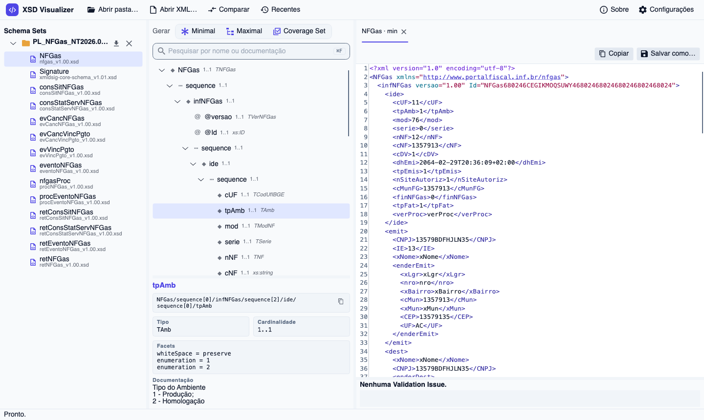

<p align="center"></p>

# XSD Visualizer

[](https://github.com/renatoassis01/xsd-visualizer/actions/workflows/ci.yml) [](https://github.com/renatoassis01/xsd-visualizer/releases/latest) [](LICENSE)

🇺🇸 [English version](README.en.md)

Aplicativo desktop multiplataforma (Windows, macOS, Linux) para explorar conjuntos de XSD e WSDL, gerar XMLs e envelopes SOAP de exemplo válidos, validar XMLs e envelopes existentes e comparar duas versões de um mesmo conjunto de schemas. Nasceu para acompanhar os novos schemas da SEFAZ (NF-e, NFGas, NFCom…), mas é genérico: funciona com qualquer XSD 1.0.

📖 **[Manual do usuário](docs/manual/pt-BR.md)**: como usar cada tela, com capturas. · [User guide (English)](docs/manual/en.md)



## Baixar e instalar

Baixe a versão mais recente em **[Releases](https://github.com/renatoassis01/xsd-visualizer/releases/latest)**. Os executáveis são self-contained: não precisam do .NET instalado.

| Sistema | Arquivo |
|---|---|
| Windows | `…-windows-x64-setup.exe` (instalador) ou `…-windows-x64.zip` (portátil); ARM: `…-windows-arm64-…` |
| macOS (Apple Silicon) | `…-macos-arm64.dmg` |
| macOS (Intel) | `…-macos-x64.dmg` |
| Linux | `…-linux-x64.AppImage`, `.deb` ou `.tar.gz`; ARM: `…-linux-arm64.…` |

**macOS com Homebrew** (recomendado: já libera o app para abrir e atualiza com `brew upgrade`):

```bash
brew install --cask renatoassis01/tap/xsd-visualizer
```

**macOS pelo `.dmg`:** o app não é assinado com um Apple Developer ID, então na primeira vez o macOS diz que não consegue verificá-lo. Arraste o app para Aplicativos e rode no Terminal:

```bash
xattr -dr com.apple.quarantine "/Applications/XSD Visualizer.app"
```

Ou tente abrir uma vez e vá em *Ajustes do Sistema → Privacidade e Segurança → Abrir Mesmo Assim*.

**Windows:** o SmartScreen pode mostrar "O Windows protegeu o computador", porque o instalador não é assinado. Clique em *Mais informações → Executar assim mesmo*.

**Linux:** `chmod +x XsdVisualizer-*.AppImage` e execute, ou instale o pacote com `sudo apt install ./XsdVisualizer-*.deb` (o comando fica `xsd-visualizer`).

## O que ele faz

- **Abre Schema Sets:** selecione ou arraste uma pasta de XSDs (ou um `.xsd`/`.wsdl` solto, que abre a pasta dele). Includes e imports são resolvidos; imports remotos usam schemas W3C embutidos, depois um cache local e só então são baixados.
- **Mostra a estrutura** de cada Global Element numa árvore pesquisável: cardinalidade, tipo, `sequence`/`choice`/`all`, facets, documentação, recursão, substitution groups, `xsi:type` e wildcards.
- **Gera Samples válidos e determinísticos:**
  - **Minimal:** só o que o Schema Set exige.
  - **Maximal:** todos os opcionais; em cada alternativa, o ramo escolhido na árvore.
  - **Coverage Set:** o menor conjunto de Samples em que cada ramo de choice, opcional e valor de enumeração aparece ao menos uma vez.
  - **Gerar todos:** grava tudo em `<saída>/<Schema Set>/<Global Element>/<nome>.{max,min,cov-NN}.xml`.
- **Valida Documents:** um XML arrastado é vinculado (Binding) ao Global Element certo e validado num editor com destaque de sintaxe, revalidação enquanto você digita e Validation Issues sublinhadas.
- **Serviços (WSDL):** os `.wsdl` da pasta aparecem como Services → Operations. Em cada Operation você escolhe o Endpoint (SOAP 1.1/1.2) e o **Payload Binding** (qual Global Element vai no Body e se vai compactado em gzip+base64), e os mesmos botões geram **Envelopes** SOAP completos. Um envelope capturado é validado em três camadas: SOAP, Body do WSDL e Payload. O app não chama os serviços.
- **Compara Schema Sets:** escolha um Antes e um Depois e veja os Global Elements que entraram, saíram ou mudaram, a árvore de mudanças (tipo, cardinalidade, facets, enumerações, documentação) e um diff lado a lado dos Samples. O resumo pode ser exportado em Markdown.
- **Temas e idioma:** Índigo (padrão, claro e escuro), Igual ao sistema, Claro, Escuro, GitHub Claro/Escuro, Dracula, Gruvbox Light, Andromeda, One Light/Dark, Nord, Catppuccin Latte/Mocha e Tokyo Night (Night, Storm, Moon, Day); interface em português ou inglês.
- **Sessão:** reabre os Schema Sets da última vez, guarda recentes, Payload Bindings e preferências, e recarrega sozinho quando um XSD ou WSDL muda em disco.

O vocabulário (Schema Set, Global Element, Sample, Coverage Set, Document, Binding, Validation Issue, Service, Operation, Payload, Payload Binding, Envelope, Comparison, Element Pair, Change) está definido em [`CONTEXT.md`](CONTEXT.md) e é usado igual no código e na interface.

## Tecnologias

| Camada | Tecnologia |
|---|---|
| Runtime | .NET 10 (C#) |
| Interface | [Avalonia UI](https://avaloniaui.net/) 12 com tema Fluent |
| Editor XML | [AvaloniaEdit](https://github.com/AvaloniaUI/AvaloniaEdit) |
| MVVM | [CommunityToolkit.Mvvm](https://learn.microsoft.com/dotnet/communitytoolkit/mvvm/) (`[ObservableProperty]`, `[RelayCommand]`) |
| XSD e validação | `System.Xml.Schema` do .NET (XSD 1.0) |
| Diff de texto | [DiffPlex](https://github.com/mmanela/diffplex) |
| Testes | xUnit |
| Textos da interface | `Strings.resx` (português) e `Strings.en.resx` (inglês), com classe `Strings` gerada no build |

Sem dependências nativas além das do Avalonia; o Core usa só a BCL e o DiffPlex.

## Estrutura do repositório

```
xsd-visualizer/
├── CONTEXT.md                      glossário do domínio
├── docs/
│   ├── manual/                     manual do usuário (pt-BR e en)
│   ├── images/                     capturas de tela do manual
│   ├── adr/                        decisões de arquitetura (ADRs)
│   └── spec/                       especificações (user stories, decisões)
├── src/
│   ├── XsdVisualizer.Core/         domínio: carga, árvore, geração, validação, WSDL, comparação (sem UI)
│   │   └── W3C/                    xmldsig, xml.xsd e envelopes SOAP 1.1/1.2 embutidos
│   └── XsdVisualizer.App/          aplicativo Avalonia (MVVM)
│       ├── ViewModels/
│       ├── Views/
│       ├── Themes/                 catálogo de temas e aplicação na interface
│       ├── Services/               sessão, monitoramento de pastas, diálogos
│       └── Resources/              textos da interface (pt-BR e en)
├── tests/
│   ├── XsdVisualizer.Core.Tests/   testes do Core pela fachada pública
│   ├── XsdVisualizer.App.Tests/    testes do catálogo de temas
│   └── Fixtures/                   pacotes reais da SEFAZ (XSDs e WSDLs)
├── packaging/                      empacotamento: .app/.dmg, instalador Windows, AppImage/.deb
├── .github/workflows/              CI (testes nos 3 sistemas) e release por tag
└── publish.sh                      executáveis self-contained por plataforma (local)
```

## Arquitetura

Duas camadas com dependência num único sentido: **App → Core**. Todo o comportamento testável mora no Core; o App é uma casca fina de view models e views sobre ele.

```
 ┌─────────────────────────── XsdVisualizer.App ────────────────────────────┐
 │  Views (XAML) ⇄ ViewModels (MVVM) → Services (sessão, watcher) · Themes  │
 └───────────────────────────────┬──────────────────────────────────────────┘
                                 │ usa só a fachada pública
 ┌───────────────────────────────▼────────── XsdVisualizer.Core ────────────┐
 │  SchemaSetLoader ──► SchemaSet ──► GlobalElement ──► SchemaNode (árvore)  │
 │        │                │               │                                │
 │  SchemaResolver         │               ├─► SampleGenerator ─► Sample    │
 │  (W3C → cache → rede)   │               │     ├ ValueGenerator           │
 │                         │               │     ├ XsdRegexGenerator        │
 │  WsdlReader ────────────┴─► Service     │     └ CoverageChoices          │
 │                     └► Operation ─► Envelopes (Sample + SampleEnvelope)  │
 │                                         └─► Validate → ValidationIssue   │
 │  DocumentBinding   SampleExporter   Comparison ─► StructuralDiff         │
 │                                                 └► SampleDiff (DiffPlex) │
 └──────────────────────────────────────────────────────────────────────────┘
```

### Core (`XsdVisualizer.Core`)

A fachada pública é pequena:

| Tipo | Papel |
|---|---|
| `SchemaSetLoader` | `Open(pasta, .xsd ou .wsdl)` → `SchemaSet`. Recebe um `ISchemaDownloader` e a pasta de cache (injeção para testes). |
| `SchemaSet` | Pasta aberta: `GlobalElements`, `Services` e `LoadIssues`. |
| `GlobalElement` | `Tree`, `GenerateMaximal(pins)`, `GenerateMinimal(through)`, `GenerateCoverageSet()`, `Validate(xml)`. |
| `SchemaNode` | Nó da árvore (elemento, atributo, compositor, wildcard), com filhos construídos sob demanda. |
| `Sample` | XML gerado + tipo, número, o que cobre e suas Validation Issues. Um Envelope carrega também um `SampleEnvelope` (mensagem, Payload Binding e Payload legível). |
| `DocumentBinding` | Encontra os Global Elements (ou Operations, para envelopes SOAP) candidatos para a raiz de um XML. |
| `SampleExporter` | "Gerar todos" de um Schema Set, inclusive os Envelopes das Operations com Payload Binding. |
| `ValidationIssue` | Mensagem + arquivo, linha, coluna e severidade (e se aponta para o Payload descompactado de um Envelope). |
| `Service` / `Endpoint` / `Operation` / `OperationMessage` | O que foi lido dos WSDLs. `OperationMessage.GenerateEnvelopes(...)` e `ValidateEnvelope(...)`. |
| `PayloadBinding` | Global Element do Payload de uma Request/Response + se vai compactado. |
| `Comparison` | `Compare(antes, depois)` → Element Pairs com `ChangeKind`; cada par dá a árvore de Changes, o diff lado a lado dos Samples e o resumo em Markdown (`ToMarkdown`). |

Como as peças internas funcionam:

- **Carga** (`SchemaSetLoader`): cada *arquivo raiz* da pasta (um XSD que nenhum outro inclui) é compilado num `XmlSchemaSet` próprio. Pastas reais misturam versões que redefinem os mesmos nomes, e compilar tudo junto quebra (ADR-0003). Por isso um Global Element é identificado por nome **e** arquivo declarante. Arquivos malformados, erros de compilação e construções XSD 1.1 viram Validation Issues de carga (ADR-0002).
- **Árvore** (`SchemaTreeBuilder`): lê o schema compilado e monta `SchemaNode`s de forma preguiçosa. Substitution groups e tipos abstratos/derivados aparecem como um nó *Choice* de alternativas. Recursão é marcada, não expandida.
- **Geração** (`SampleGenerator`): percorre a árvore escrevendo com `XmlWriter`.
  - Repetições: o Minimal usa `minOccurs`; o Maximal usa `max(minOccurs, min(maxOccurs, 2))`.
  - Recursão: expandida uma vez; dali para baixo, só o mínimo.
  - Wildcards opcionais são omitidos; um obrigatório `lax`/`skip` ganha um `<exemplo/>`.
  - As escolhas de ramo e de enumeração vêm de uma estratégia plugável (`IGenerationChoices`): ramos fixados (`PinnedChoices`) ou cobertura gulosa (`CoverageChoices`, ADR-0001).
- **Valores** (`ValueGenerator` + `XsdRegexGenerator`): candidatos determinísticos a partir de enumerações, `pattern` (gerador próprio de strings para regex XSD), tamanhos, dígitos e faixas, conferidos por `XmlSchemaDatatype.ParseValue`. IDs e valores de `key`/`unique` saem distintos. No fim, o Sample inteiro é validado; se algo não for satisfazível, ele sai marcado como inválido, nunca descartado.
- **WSDL** (`WsdlReader`, `Envelopes`): cada WSDL 1.1 vira Services/Endpoints/Operations; os schemas de `wsdl:types` são compilados à parte (ADR-0004). Envelopes são montados em volta do Payload gerado pelo Global Element vinculado. A validação de um Envelope junta numa passada os XSDs do SOAP, os do WSDL e os do Payload; um Payload compactado é descompactado e validado à parte.
- **Comparação** (`Comparison`, `StructuralDiff`, `SampleDiff`): os pares são feitos por namespace + nome + arquivo e, na falta, por namespace + nome. As árvores dos dois lados são percorridas em paralelo pelo caminho de nomes, gerando Changes (Added, Removed, Modified, Documentation-only). O diff lado a lado gera os Samples dos dois lados com as mesmas regras, passando pelo ramo da Change selecionada, e compara linha a linha com o DiffPlex.

### App (`XsdVisualizer.App`)

- **`MainViewModel`** orquestra Schema Sets abertos, geração, exportação, abas e salvamento; delega a árvore e a pesquisa a **`SchemaTreeViewModel`** e os Payload Bindings a **`PayloadBindingStore`**. Trabalho pesado roda em `Task.Run`.
- **`SchemaNodeViewModel`** embrulha `SchemaNode`; choices mostram um seletor de ramo que alimenta os *pins* do Maximal. **`OperationViewModel`** cuida de Endpoint, Request/Response e Payload Binding.
- **`EditorTabViewModel`**: uma aba é um Document (com Binding e "salvar") ou um conjunto de Samples (com seletor e painel "cobre"). O texto vive num `TextDocument` do AvaloniaEdit; alterações disparam revalidação com atraso de 400 ms.
- **`ComparisonViewModel`**: pares, árvore de Changes com filtros e navegação, e o diff lado a lado (Maximal/Minimal) regenerado quando a Change selecionada está em outro ramo.
- **Themes:** `ThemeCatalog` é dado puro (sem Avalonia) com as cores de cada tema; `ThemeApplier` troca a variante e a paleta do Fluent e os recursos do app na hora.
- **Views:** `MainWindow`, `XmlEditorView` (editor, issues e sublinhado), `ComparisonWindow`, `CompareDialog`, `SettingsWindow`, `AboutWindow` e `ConfirmDialog`.
- **Services:** `SessionStore` (JSON em `LocalApplicationData/XsdVisualizer/session.json`, ou no caminho de `XSDVISUALIZER_SESSION`) e `SchemaFolderWatcher` (`FileSystemWatcher` com debounce).
- Caminhos passados na linha de comando abrem como se tivessem sido arrastados.

## Decisões registradas

- [ADR-0001](docs/adr/0001-coverage-set-em-vez-de-produto-cartesiano.md): Coverage Set em vez de produto cartesiano.
- [ADR-0002](docs/adr/0002-apenas-xsd-1-0.md): apenas XSD 1.0.
- [ADR-0003](docs/adr/0003-compilacao-por-arquivo-raiz.md): compilação por arquivo raiz.
- [ADR-0004](docs/adr/0004-apenas-wsdl-1-1-document-literal.md): apenas WSDL 1.1 document/literal.
- Specs: [v1](docs/spec/0001-xsd-visualizer-v1.md), [WSDL](docs/spec/0002-wsdl.md), [Comparação](docs/spec/0003-comparacao.md), [Temas](docs/spec/0004-temas.md), [Refatoração](docs/spec/0005-refatoracao.md) e [Distribuição](docs/spec/0006-distribuicao.md).

## Build, execução e testes

### Pré-requisito

[.NET SDK 10](https://dotnet.microsoft.com/download). Confira com `dotnet --list-sdks` (deve listar `10.0.x`).

Se o SDK foi instalado pelo script `dotnet-install.sh` (em `~/.dotnet`, sem sudo), coloque-o no `PATH`:

```bash
export PATH="$HOME/.dotnet:$PATH"   # adicione ao ~/.zshrc para ficar permanente
```

Todos os comandos abaixo rodam na raiz do repositório (onde está `XsdVisualizer.slnx`).

### Build

```bash
dotnet build                        # solution inteira, Debug
dotnet build -c Release             # Release
dotnet build src/XsdVisualizer.App  # só o app (compila o Core junto)
```

O primeiro build restaura os pacotes NuGet. A classe `Strings` é gerada a partir dos `.resx` durante o build e não fica versionada.

### Executar

```bash
dotnet run --project src/XsdVisualizer.App

# já abrindo Schema Sets e Documents (pastas, .xsd, .wsdl ou .xml), como se tivessem sido arrastados
dotnet run --project src/XsdVisualizer.App -- tests/Fixtures/PL_NFGas_NT2026.002_RTC_1.01 caminho/do/documento.xml

# com uma sessão separada, sem mexer na sua
XSDVISUALIZER_SESSION=/tmp/sessao-teste.json dotnet run --project src/XsdVisualizer.App
```

### Testes

```bash
dotnet test                                                   # tudo
dotnet test --filter "Category!=Integration"                  # só os rápidos, sem os pacotes reais
dotnet test --filter "Category=Integration"                   # só a integração com os pacotes reais
dotnet test --filter "FullyQualifiedName~CoverageSetTests"    # uma classe de testes
```

- **Core** (`tests/XsdVisualizer.Core.Tests`), um arquivo por área: abertura, árvore, geração, Coverage Set, validação, Binding, schemas remotos, exportação, WSDL (carga, envelopes, validação), comparação (diff estrutural e de Samples) e pacotes reais.
- **App** (`tests/XsdVisualizer.App.Tests`): o catálogo de temas (todo tema define todas as cores; contraste WCAG de texto, sintaxe, diff e sublinhado; modo claro/escuro coerente com o fundo).
- **Snapshot das saídas:** `OutputSnapshotTests` guarda o hash de cada XML gerado a partir das fixtures em `Snapshots/outputs.sha256`, para garantir que uma refatoração não muda nenhuma saída. Se a mudança for intencional, regenere com `XSDVIS_UPDATE_SNAPSHOTS=1 dotnet test --filter OutputSnapshotTests` e confira o diff.

Como os testes são pensados:

- Exercitam só a fachada pública, com XSDs sintéticos pequenos (um por caso) escritos em pastas temporárias.
- **Oráculo:** o validador do próprio .NET. Todo Sample e todo Envelope gerado precisa validar.
- **Integração:** Coverage Set e Minimal de todos os Global Elements da NF-e (PL_010_V1.30) e da NFGas; WSDLs da NF-e 4.00 e da NFCom; comparação PL_009_V4 → PL_010_V1.30.
- **Rede:** schemas remotos são testados com um `ISchemaDownloader` falso, sem rede.
- A interface (views) não tem testes automatizados.

### Publicar executáveis

```bash
./publish.sh                 # win-x64, osx-arm64, osx-x64 e linux-x64
./publish.sh osx-arm64       # só uma plataforma
```

A saída vai para `dist/<rid>/` (ignorado pelo git): um executável único self-contained, com cerca de 100 MB, que roda sem o .NET instalado. No macOS, rode `./dist/osx-arm64/XsdVisualizer`; no Windows, `dist\win-x64\XsdVisualizer.exe`.

### Publicar uma versão

Os releases saem do GitHub Actions:

- **CI** (`.github/workflows/ci.yml`): todo push na `main` e todo PR rodam build + testes em Linux, macOS e Windows.
- **Release** (`.github/workflows/release.yml`): uma tag `v*` roda os testes, empacota as seis plataformas (Windows, macOS e Linux, x64 e arm64), cria o release com os arquivos, `SHA256SUMS.txt` e notas geradas a partir dos commits, e atualiza a cask no [tap do Homebrew](https://github.com/renatoassis01/homebrew-tap).
- **Homebrew** (`.github/workflows/homebrew.yml`): gera a cask a partir de `packaging/homebrew/` e dos checksums do release, e faz push no tap com a deploy key do secret `HOMEBREW_TAP_DEPLOY_KEY`. Também roda à mão (*Run workflow* com a tag). Tags de pré-release (`v1.3.0-beta.1`) não vão para o tap.

```bash
git tag v1.2.0
git push origin v1.2.0
```

A versão vem da tag (vira a versão do assembly, mostrada no Sobre). Os scripts em `packaging/` também rodam à mão: `packaging/package-macos.sh osx-arm64 1.2.0` no macOS, `packaging/package-linux.sh linux-x64 1.2.0` no Linux e `packaging/package-windows.sh win-x64 1.2.0` no Git Bash do Windows (com Inno Setup). A saída vai para `dist/release/`.

## Licença

[MIT](LICENSE). Os XSDs e WSDLs em `tests/Fixtures` são documentos públicos da SEFAZ, incluídos só como dados de teste.
