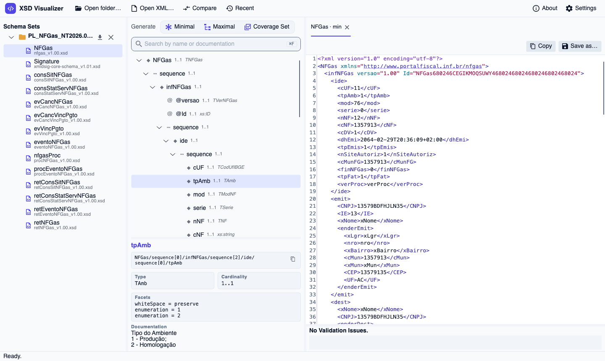
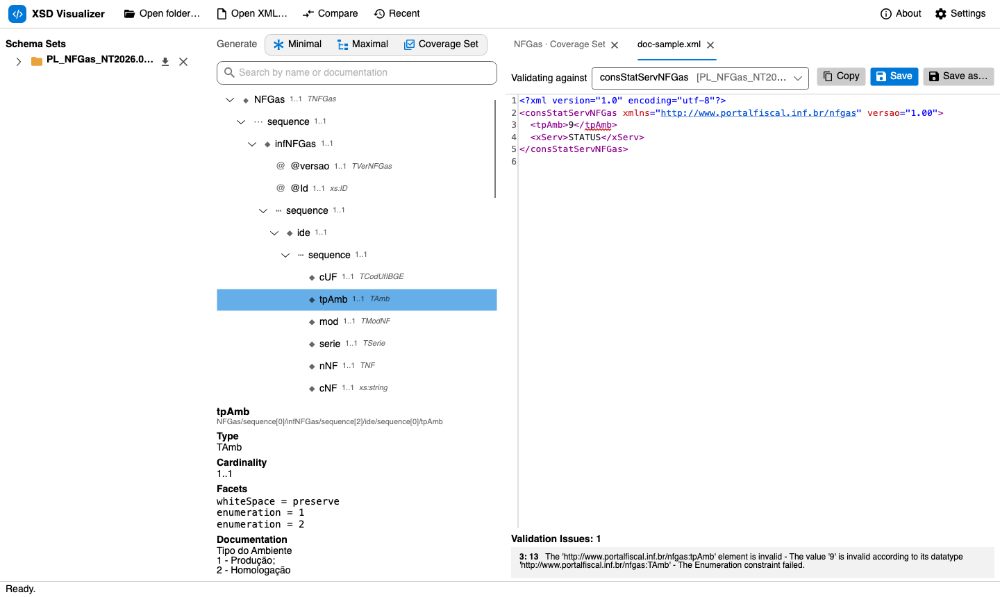
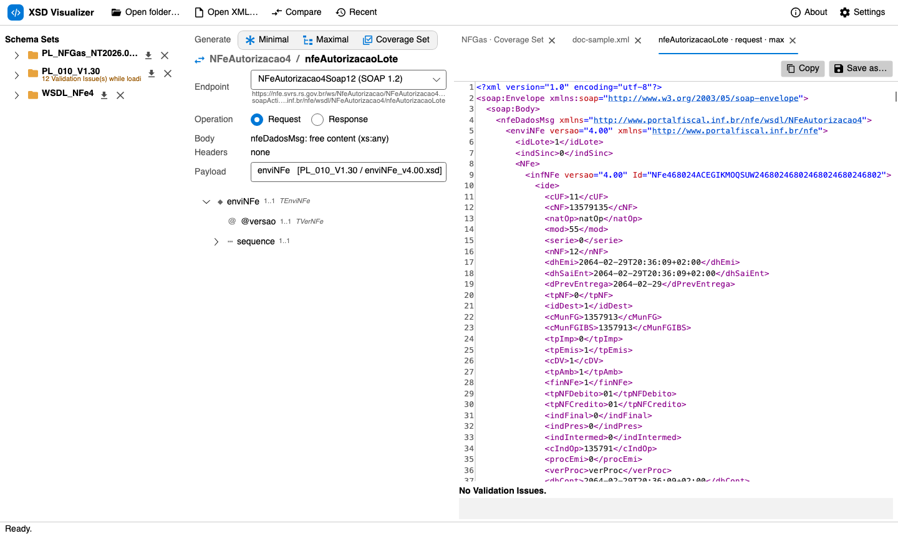
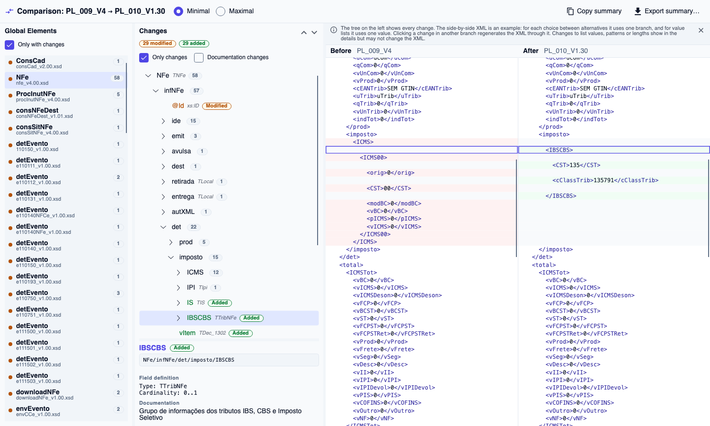
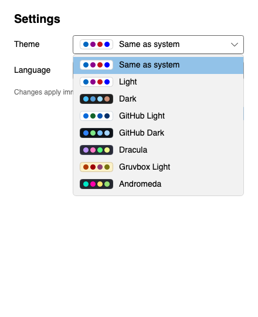
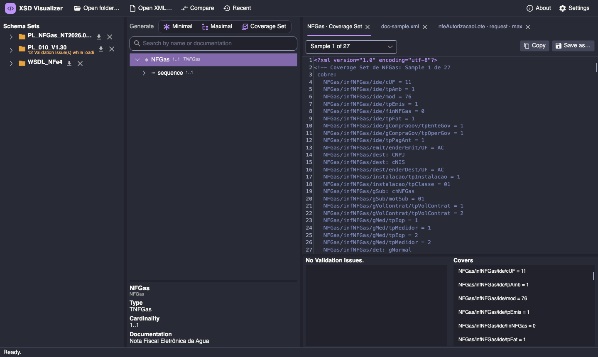

# User guide — XSD Visualizer

🇧🇷 [Versão em português](pt-BR.md)

XSD Visualizer opens sets of XSD and WSDL files, shows their structure, generates valid sample XML and SOAP envelopes, validates XML you already have, and compares two versions of the same set of schemas. It works with any XSD 1.0 and is not tied to any particular schema publisher.

The domain terms used in the interface (Schema Set, Global Element, Sample, Coverage Set, Validation Issue, Payload…) are defined in the [glossary](../../CONTEXT.md).

## Contents

1. [Install and launch](#1-install-and-launch)
2. [The main window](#2-the-main-window)
3. [Opening Schema Sets](#3-opening-schema-sets)
4. [Exploring the tree](#4-exploring-the-tree)
5. [Generating Samples](#5-generating-samples)
6. [Editor: copy and save](#6-editor-copy-and-save)
7. [Validating your own XML](#7-validating-your-own-xml)
8. [Generate all](#8-generate-all)
9. [Services (WSDL)](#9-services-wsdl)
10. [Comparing two versions](#10-comparing-two-versions)
11. [Settings: theme and language](#11-settings-theme-and-language)
12. [Session, recents and automatic reload](#12-session-recents-and-automatic-reload)
13. [Limitations](#13-limitations)
14. [Troubleshooting](#14-troubleshooting)

---

## 1. Install and launch

**Prebuilt release.** Download from [Releases](https://github.com/renatoassis01/xsd-visualizer/releases/latest): installer or `.zip` on Windows, `.dmg` on macOS, and AppImage, `.deb` or `.tar.gz` on Linux, for x64 and ARM. .NET does not need to be installed. Since the app is not signed, macOS and Windows ask you to allow it the first time; the steps are in the [README](../../README.en.md#download-and-install).

**From source.** With the .NET 10 SDK installed:

```bash
dotnet run --project src/XsdVisualizer.App
```

**Opening files directly.** Folders, `.xsd`, `.wsdl` and `.xml` files passed on the command line open as if they had been dropped on the window:

```bash
XsdVisualizer ~/schemas/PL_010_V1.30 ~/invoices/invoice.xml
```

## 2. The main window



- **Top bar:** Open folder…, Open XML…, Compare, Recent; on the right, About and Settings.
- **Left column (Schema Sets):** the open sets, each with its Global Elements (and a Services group when there is a WSDL). Each Global Element shows the file that declares it underneath; hovering over it shows its documentation, file and namespace. Next to each Schema Set are the **Generate all** (⤓) and **Close** (✕) buttons.
- **Middle column:** the **Generate** buttons (Minimal, Maximal, Coverage Set), the search box, the tree of the selected item and, below it, the details of the selected node.
- **Right column:** the editor tabs, one per generated Sample or opened XML, with the list of Validation Issues underneath.
- **Status bar:** what is happening (opening, generating, saved, copied…).

## 3. Opening Schema Sets

A **Schema Set** is a folder of XSDs (and WSDLs) opened as a whole. There are four ways to open one:

- **Open folder…** and pick the folder.
- **Drop** the folder on the window.
- Drop a single `.xsd` or `.wsdl`: its folder is opened.
- **Recent**: the last ten folders you opened.

While loading:

- `xs:include` and `xs:import` are resolved from the folder itself.
- Remote imports (for example `xmldsig`) use embedded copies of the most common W3C schemas first, then a local cache, and only then a download.
- Every file that no other file includes is compiled on its own, because real folders often mix versions that redefine the same names. That is why a Global Element is shown with its name **and** the file that declares it.

Problems found while loading (malformed file, missing type, XSD 1.1 construct, unavailable remote schema) show in orange under the Schema Set name, for example *"12 Validation Issue(s) while loading"*. The rest of the set remains usable.

You can have several Schema Sets open at once. You need that to [compare](#10-comparing-two-versions) and to [bind WSDL Payloads](#9-services-wsdl).

## 4. Exploring the tree

Select a Global Element on the left to see its tree in the middle. Each row shows:

| Icon | Meaning |
|---|---|
| ◆ | element |
| @ | attribute |
| ⋯ | compositor (`sequence`, `choice`, `all`) |
| `1..1`, `0..n` | cardinality (min..max) |
| italic text | type (`TAmb`, `xs:string`…) |

When you select a node, the details panel shows its **path**, **type**, **cardinality**, **facets** (length, `pattern`, digits, ranges, enumeration values), fixed or default value, and **documentation** (`xs:documentation`).

Some special cases:

- **Alternatives.** An `xs:choice`, a substitution group, or an abstract type with derived types (`xsi:type`) shows as a choice. A selector next to it sets which alternative the **Maximal** uses.
- **Recursion.** A type that contains itself is marked as recursive and only expands when you ask.
- **Wildcards** (`xs:any`, `xs:anyAttribute`) say which namespace they accept content from.

**Search.** The *Search by name or documentation* box searches the whole Global Element, including branches that have not been expanded yet. Results appear in a list right below it; click one to open and select that node in the tree. **Esc** clears the search.

## 5. Generating Samples

With a Global Element selected, the **Generate** buttons create valid sample XML, each in a new tab:

| Button | What it generates |
|---|---|
| **Minimal** | Only what is required: optional fields are left out, and repeated items appear the minimum number of times. |
| **Maximal** | Every possible field, optional ones included. Repeated items appear twice (or the maximum, if lower). For each set of alternatives, it uses the first one or the one you picked in the tree. |
| **Coverage Set** | Several XMLs that, together, show every possibility: each alternative of an `xs:choice`, each optional element and each enumeration value appears in at least one of them. |

In a Coverage Set, the *Sample 1 of N* selector switches between the XMLs. The comment at the top of each one and the **Covers** panel tell you what that Sample covers (for example `NFGas/infNFGas/ide/tpAmb = 1` or `NFGas/infNFGas/dest: CNPJ`).

**How values are chosen.** Values satisfy every facet of their type: enumeration, `pattern` (there is a dedicated generator for XSD regular expressions), length, digits and ranges. IDs (`xs:ID`) are unique, and identity constraints (`xs:key`, `xs:unique`) are respected.

Generation is **deterministic**: the same schema always produces the same XML, so you can compare versions with any diff tool.

Other details:

- **Recursion:** expanded once; below that, only the minimum is included.
- **Wildcards:** an optional wildcard is left out; a required one gets an `<exemplo/>` placeholder.
- **Validation:** every Sample is validated against its own Schema Set. If a schema rule cannot be satisfied, the Sample is still produced, marked invalid with its Validation Issues listed, instead of being dropped.

## 6. Editor: copy and save

Each tab has an XML editor with syntax highlighting and line numbers.

- **Copy** copies the whole XML to the clipboard.
- **Save as…** writes the XML to a file.
- **Save** (for XML opened from disk) writes back to the original file. If the XML has Validation Issues, the app asks you to confirm first.
- You can edit Samples. As you type, the XML is validated again after a short pause.

## 7. Validating your own XML

Drop an `.xml` on the window or use **Open XML…**. Among the open Schema Sets, the app looks for the Global Element that declares the XML's root (the **Binding**) and validates against it.



- **Validating against** shows the chosen Global Element. If there is more than one candidate (for example, the same root in different versions), pick one in that list.
- Each **Validation Issue** is underlined in the editor and listed below with its line and column. Click one to jump to it.
- Validation runs again as you type.
- Malformed XML, or XML whose root no open Schema Set declares, is shown without validation, with a notice.

## 8. Generate all

The **Generate all** button (⤓), next to the Schema Set name, generates the Maximal, the Minimal and the Coverage Set of **every** Global Element into an output folder you choose:

```
<output>/<Schema Set>/<Global Element>/<Global Element>.max.xml
                                       <Global Element>.min.xml
                                       <Global Element>.cov-01.xml …
<output>/<Schema Set>/_servicos/<Service>/<operation>.request.max.xml …
```

The `_servicos` folder only exists when the Schema Set has WSDLs, and it only includes Operations that have a [Payload Binding](#9-services-wsdl). The status bar shows progress and, at the end, how many Samples were written and how many are invalid.

## 9. Services (WSDL)

The WSDLs in a Schema Set's folder appear in the **Services** group, with their Services and Operations. The app recognizes a WSDL by its content, so a WSDL saved as `.xsd` works too.

**Step by step.** The WSDL only describes the envelope; the business XML comes from the XSD package. So:

1. Open (or drop) the WSDL. It is fine if it is alone in its folder.
2. Also open the service's folder of XSDs (for example, the NFGas schema package).
3. Select the Operation under **Services** and, in **Payload**, choose the Global Element that goes in the Body (for example, `consSitNFGas` for a query).
4. Click **Minimal**, **Maximal** or **Coverage Set**. The app supports WSDL 1.1 `document/literal` over SOAP 1.1 and 1.2. It builds and validates envelopes, but it does **not call** the services.



When you select an Operation, the middle column shows:

- **Endpoint:** which port to use, with address, SOAP version and `soapAction`. SOAP 1.2 is the default when available.
- **Request / Response:** which message you want to see and generate.
- **Body and Headers:** what the WSDL declares for that message.
- **Payload:** a WSDL usually only says the Body holds "free content" (`xs:any`) or text. So you choose which Global Element goes inside it, from **any** open Schema Set. That choice is the **Payload Binding**, and it is saved.
- **Compressed (gzip+base64):** check this when the service expects a compressed Payload. It is already checked when the Body is declared as text.

With a Payload Binding in place, the **Minimal**, **Maximal** and **Coverage Set** buttons generate complete SOAP **Envelopes**, in the namespace of the Endpoint's SOAP version and with the declared headers. For a compressed envelope, **Open Payload** shows the readable XML in a tab next to it. Without a Payload Binding, the envelope is marked invalid with a notice that the binding is missing.

**Validating a captured envelope.** Drop a SOAP envelope (from a log, for example). The app finds the Operation from the element inside the Body and validates three layers in a single list: the SOAP envelope, the Body declared in the WSDL, and the Payload against its Global Element. Compressed Payloads are decompressed for validation, and their Validation Issues refer to the decompressed text.

## 10. Comparing two versions

When a new version of a set of schemas comes out, the **Compare** button shows what changed. Open both Schema Sets, click **Compare**, and choose which one is **Before** (the reference) and which one is **After**.



The Comparison window has three areas:

1. **Global Elements** (left): the Global Elements that were added, removed, changed or left unchanged, with their number of changes. Pairs are matched by namespace, name and file; failing that, by namespace and name when there is only one on each side. **Only with changes** hides the unchanged ones.
2. **Changes** (middle): the Global Element's tree with each change colored.
   - 🟢 **Added:** a new element or attribute.
   - 🔴 **Removed:** an element or attribute that is gone.
   - 🟡 **Modified:** a change of type, cardinality, facets (length, `pattern`, digits, ranges), fixed or default value, or enumeration values. The details panel shows *before → after* and, for enumerations, the values added and removed.
   - Documentation-only changes are hidden; check **Documentation changes** to see them.
   - When you select a field, the panel also shows the **Field definition**: type, cardinality, facets (`pattern`, lengths, digits, ranges, enumeration) and fixed or default value. For an added field this is its definition in After; for a removed one, in Before.
   - A collapsed node shows how many changes it contains.
   - The ⌃ ⌄ arrows go to the previous or next change.
3. **Side-by-side XML** (right): a Sample from Before and one from After, with added lines in green, removed lines in red and modified lines in amber. Clicking a change scrolls both sides to it. **Minimal** (the default) and **Maximal**, at the top, switch the kind of Sample used: the Minimal is leaner and goes through the selected change; the Maximal shows every optional item of the chosen branch at once.

**Limits of the side-by-side XML.** The tree shows every change. The XML is only an example:

- For each choice between alternatives it uses one branch, and for value lists it uses one value.
- Clicking a change in another branch regenerates the XML through it. In the Minimal, the selected change is included too, even when it is optional.
- Changes to list values, patterns or lengths show in the details but may not change the XML.

**Summary.** **Copy summary** and **Export summary…** produce Markdown listing the Global Elements that were added, removed and changed. For each changed one, there is a table with the path, the kind of change and *before → after* (or, for added or removed fields, the field definition), ready to paste into an issue or a team document.

The comparison covers XSDs. WSDL Services and Operations are not compared, and renames show up as a removal plus an addition.

## 11. Settings: theme and language

Open **Settings** (on macOS, also from the app menu or with ⌘,). Changes apply immediately and are saved.



- **Theme:** Same as system, Light, Dark, GitHub Light, GitHub Dark, Dracula, Gruvbox Light and Andromeda. Each theme has a color swatch next to its name. The theme changes the whole app: windows, panels, the editor, syntax colors, Comparison diff colors and Validation Issue underlines.
- **Language:** Same as system, Português (Brasil) or English.



The comments the generator writes inside the XML (such as *"Coverage Set de NFGas: Sample 1 de 27 — cobre: …"*) are always in Portuguese, so generated files do not change with the interface language.

## 12. Session, recents and automatic reload

- On exit, the app saves the open Schema Sets, recents, Payload Bindings, chosen Endpoints, theme and language. When you open it again, everything is back as it was.
- If an XSD or WSDL in an open folder changes on disk, the Schema Set reloads by itself, and the status bar tells you.
- Where the files live:

| What | Where |
|---|---|
| Session | `session.json` in the app data folder: `%LOCALAPPDATA%\XsdVisualizer` (Windows), `~/Library/Application Support/XsdVisualizer` (macOS), `~/.local/share/XsdVisualizer` (Linux) |
| Remote schema cache | `schema-cache/` in the same folder |

The `XSDVISUALIZER_SESSION` environment variable points to a different session file. This is useful for testing or for keeping separate profiles.

## 13. Limitations

- **XSD 1.0 only.** XSD 1.1 constructs (`xs:assert`, `xs:alternative`…) become load-time Validation Issues ([ADR-0002](../adr/0002-apenas-xsd-1-0.md)).
- **WSDL 1.1 `document/literal` only.** WSDL 2.0, `rpc`, `encoded` and non-SOAP bindings are reported at load time and ignored ([ADR-0004](../adr/0004-apenas-wsdl-1-1-document-literal.md)).
- **A Coverage Set is not a cartesian product.** It guarantees every possibility appears at least once, not every combination ([ADR-0001](../adr/0001-coverage-set-em-vez-de-produto-cartesiano.md)).
- **Signatures** (`ds:Signature`) are generated like any other element, with sample values: they are not real signatures.
- **Business rules** that are not in the XSD (check digits, totals, an authority's validation rules) are not checked.

The ADRs and specs are written in Portuguese.

## 14. Troubleshooting

| Symptom | What to do |
|---|---|
| *"Não foi possível obter o schema remoto …"* (remote schema unavailable) | The imported schema is neither embedded nor cached, and there is no connection. Go online once so it is downloaded into the cache, or put the file in the Schema Set folder. |
| A Global Element appears twice | It is declared in two files in the folder (for example, different versions). The file name next to it tells them apart. |
| XML opened without validation | No open Schema Set declares its root. Open the right schema folder, then open the XML again. |
| Empty Payload list on an Operation | Only the WSDL is open. Also open the service's folder of XSDs. |
| Envelope Payload not validated | Set the Operation's Payload Binding (section 9). |
| Sample marked invalid | The schema has a rule the generator could not satisfy (for example, an impossible `pattern`). The Validation Issues below the editor say which one. |
