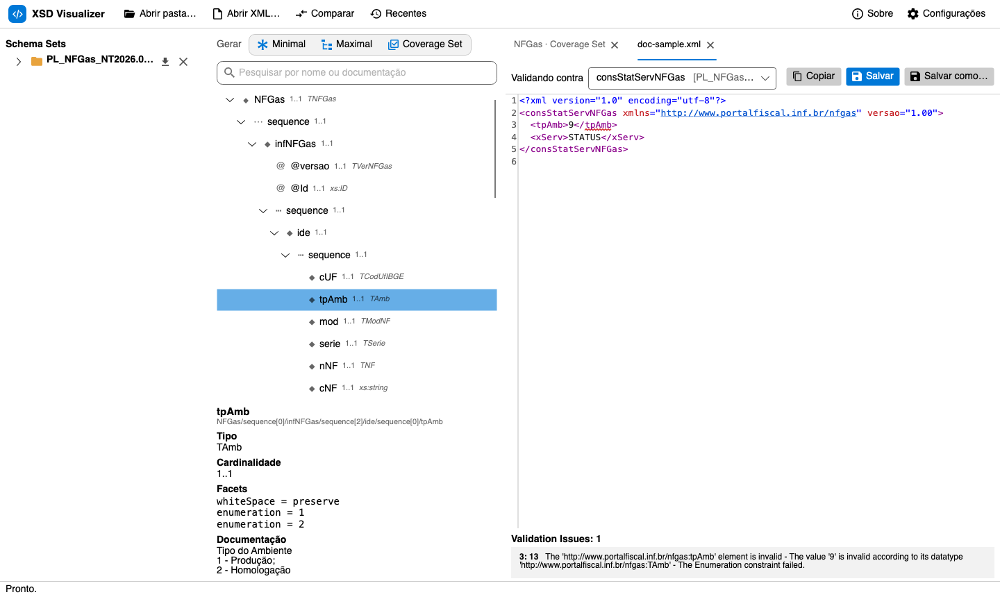
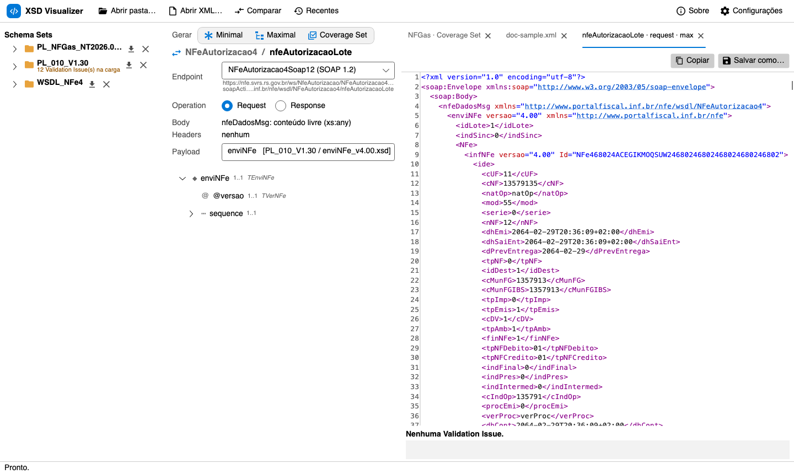
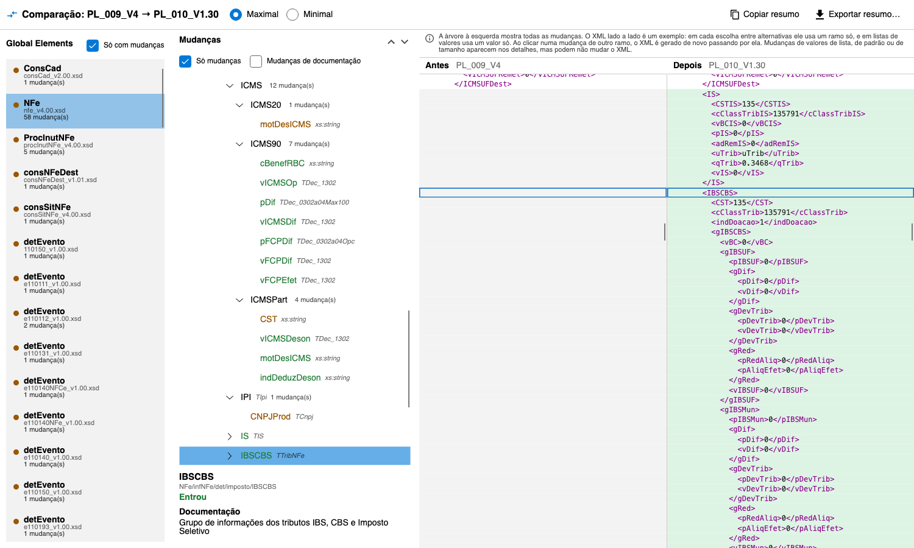
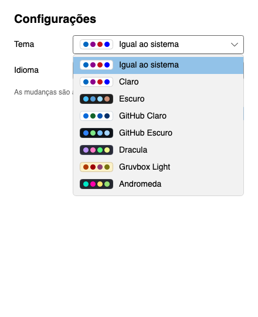
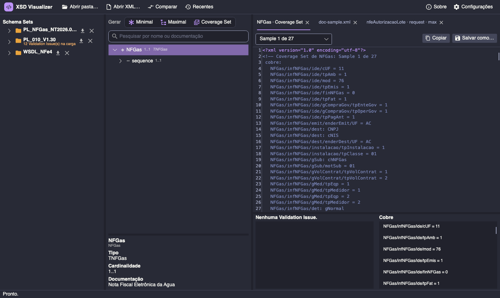

# Manual do usuário — XSD Visualizer

🇺🇸 [English version](en.md)

O XSD Visualizer abre conjuntos de XSD e WSDL, mostra a estrutura deles, gera XMLs e envelopes SOAP de exemplo válidos, valida XMLs que você já tem e compara duas versões de um mesmo conjunto de schemas. Funciona com qualquer XSD 1.0; não é preso a nenhum emissor de schemas.

Os termos em inglês da interface (Schema Set, Global Element, Sample, Coverage Set, Validation Issue, Payload…) estão definidos no [glossário](../../CONTEXT.md).

## Sumário

1. [Instalar e abrir](#1-instalar-e-abrir)
2. [Visão geral da janela](#2-visão-geral-da-janela)
3. [Abrir Schema Sets](#3-abrir-schema-sets)
4. [Explorar a árvore](#4-explorar-a-árvore)
5. [Gerar Samples](#5-gerar-samples)
6. [Editor: copiar e salvar](#6-editor-copiar-e-salvar)
7. [Validar um XML seu](#7-validar-um-xml-seu)
8. [Gerar todos](#8-gerar-todos)
9. [Serviços (WSDL)](#9-serviços-wsdl)
10. [Comparar duas versões](#10-comparar-duas-versões)
11. [Configurações: tema e idioma](#11-configurações-tema-e-idioma)
12. [Sessão, recentes e recarga automática](#12-sessão-recentes-e-recarga-automática)
13. [Limitações](#13-limitações)
14. [Solução de problemas](#14-solução-de-problemas)

---

## 1. Instalar e abrir

**Executável pronto.** Rode `./publish.sh` (veja o [README](../../README.md#publicar-executáveis)) e use o arquivo de `dist/<plataforma>/`: é um executável único que não precisa do .NET instalado.

| Plataforma | Executável |
|---|---|
| Windows | `dist\win-x64\XsdVisualizer.exe` |
| macOS (Apple Silicon) | `dist/osx-arm64/XsdVisualizer` |
| macOS (Intel) | `dist/osx-x64/XsdVisualizer` |
| Linux | `dist/linux-x64/XsdVisualizer` |

**A partir do código.** Com o .NET SDK 10 instalado:

```bash
dotnet run --project src/XsdVisualizer.App
```

**Abrindo arquivos direto.** Pastas, `.xsd`, `.wsdl` e `.xml` passados na linha de comando abrem como se tivessem sido arrastados para a janela:

```bash
XsdVisualizer ~/schemas/PL_010_V1.30 ~/notas/nota.xml
```

## 2. Visão geral da janela


- **Barra de cima:** Abrir pasta…, Abrir XML…, Comparar, Recentes; à direita, Sobre e Configurações.
- **Coluna da esquerda — Schema Sets:** os conjuntos abertos, cada um com seus Global Elements (e, se houver WSDL, um grupo Serviços). Embaixo de cada Global Element aparece o arquivo que o declara; parando o mouse sobre ele, aparecem a documentação, o arquivo e o namespace. Ao lado de cada Schema Set ficam os botões **Gerar todos** (⤓) e **Fechar** (✕).
- **Coluna do meio:** os botões **Gerar** (Minimal, Maximal, Coverage Set), a pesquisa, a árvore do item selecionado e, embaixo, os detalhes do nó selecionado.
- **Coluna da direita:** as abas do editor, uma por Sample gerado ou XML aberto, com a lista de Validation Issues embaixo.
- **Barra de status:** o que está acontecendo (abrindo, gerando, salvo, copiado…).

## 3. Abrir Schema Sets

Um **Schema Set** é uma pasta de XSDs (e WSDLs) aberta de uma vez. Há quatro jeitos de abrir:

- **Abrir pasta…** e escolher a pasta.
- **Arrastar** a pasta para a janela.
- Arrastar um `.xsd` ou `.wsdl` solto: abre a pasta dele.
- **Recentes**: as dez últimas pastas abertas.

Durante a carga:

- `xs:include` e `xs:import` são resolvidos a partir da própria pasta.
- Imports remotos (por exemplo, `xmldsig`) usam uma cópia embutida dos schemas W3C mais comuns; depois, um cache local; e só então são baixados.
- Cada arquivo que nenhum outro inclui é compilado separado, porque pastas reais costumam misturar versões que redefinem os mesmos nomes. Por isso um Global Element aparece com o nome **e** o arquivo em que foi declarado.

Problemas encontrados na carga (arquivo malformado, tipo inexistente, construção de XSD 1.1, schema remoto indisponível) aparecem em laranja embaixo do nome do Schema Set, como *"12 Validation Issue(s) na carga"*. O resto do conjunto continua utilizável.

Você pode ter vários Schema Sets abertos ao mesmo tempo, o que é necessário para [comparar](#10-comparar-duas-versões) e para [vincular Payloads de WSDL](#9-serviços-wsdl).

## 4. Explorar a árvore

Selecione um Global Element à esquerda para ver a árvore dele no meio. Cada linha mostra:

| Ícone | Significado |
|---|---|
| ◆ | elemento |
| @ | atributo |
| ⋯ | compositor (`sequence`, `choice`, `all`) |
| `1..1`, `0..n` | cardinalidade (mínimo..máximo) |
| texto em itálico | tipo (`TAmb`, `xs:string`…) |

Ao selecionar um nó, o painel de detalhes mostra o **caminho**, o **tipo**, a **cardinalidade**, os **facets** (tamanho, `pattern`, dígitos, faixas, valores de enumeração), valor fixo ou padrão e a **documentação** (`xs:documentation`).

Alguns casos especiais:

- **Alternativas.** Um `xs:choice`, um substitution group ou um tipo abstrato com tipos derivados (`xsi:type`) aparece como uma escolha. Ao lado dele há um seletor que define qual alternativa o **Maximal** vai usar.
- **Recursão.** Um tipo que contém a si mesmo é marcado como recursivo e expandido só quando você pede.
- **Wildcards** (`xs:any`, `xs:anyAttribute`) dizem de qual namespace aceitam conteúdo.

**Pesquisar.** O campo *Pesquisar por nome ou documentação* procura no Global Element inteiro, inclusive em ramos que ainda não foram expandidos. Os resultados aparecem numa lista logo abaixo; clique num deles para abrir e selecionar o nó na árvore. **Esc** limpa a pesquisa.

## 5. Gerar Samples

Com um Global Element selecionado, os botões **Gerar** criam XMLs de exemplo válidos, cada um numa aba nova:

| Botão | O que gera |
|---|---|
| **Minimal** | Só o obrigatório: opcionais ficam de fora, e o que se repete aparece o mínimo de vezes. |
| **Maximal** | Todos os campos possíveis, opcionais inclusive. Repetições aparecem duas vezes (ou o máximo, se for menor). Em cada alternativa, usa a primeira ou a que você escolheu no seletor da árvore. |
| **Coverage Set** | Vários XMLs que, juntos, mostram todas as possibilidades: cada alternativa de um `xs:choice`, cada opcional e cada valor de enumeração aparece em pelo menos um deles. |

No Coverage Set, o seletor *Sample 1 de N* troca entre os XMLs. O comentário no topo de cada um e o painel **Cobre** dizem o que aquele Sample cobre (por exemplo, `NFGas/infNFGas/ide/tpAmb = 1` ou `NFGas/infNFGas/dest: CNPJ`).

**Como os valores são escolhidos.** Os valores respeitam todos os facets do tipo: enumeração, `pattern` (há um gerador próprio para expressões regulares do XSD), tamanho, dígitos e faixas. Os IDs (`xs:ID`) são únicos, e as restrições de identidade (`xs:key`, `xs:unique`) são respeitadas.

A geração é **determinística**: o mesmo schema gera sempre o mesmo XML, o que permite comparar versões com qualquer ferramenta de diff.

Outros detalhes:

- **Recursão:** é expandida uma vez; dali para baixo, entra só o mínimo.
- **Wildcards:** um wildcard opcional é omitido; um obrigatório recebe um `<exemplo/>`.
- **Validação:** todo Sample é validado contra o próprio Schema Set. Se alguma regra do schema não puder ser satisfeita, o Sample sai mesmo assim, marcado como inválido e com as Validation Issues listadas, em vez de ser descartado.

## 6. Editor: copiar e salvar

Cada aba tem um editor XML com destaque de sintaxe e números de linha.

- **Copiar** copia o XML inteiro para a área de transferência.
- **Salvar como…** grava o XML num arquivo.
- **Salvar** (em XMLs abertos do disco) regrava o arquivo original. Se o XML tiver Validation Issues, o app pede confirmação antes.
- Os Samples podem ser editados. Ao digitar, o XML é validado de novo após uma pequena pausa.

## 7. Validar um XML seu

Arraste um `.xml` para a janela ou use **Abrir XML…**. O app procura, entre os Schema Sets abertos, o Global Element que declara a raiz do XML (o **Binding**) e valida contra ele.



- **Validando contra** mostra o Global Element escolhido. Se houver mais de um candidato (por exemplo, a mesma raiz em versões diferentes), escolha nessa lista.
- Cada **Validation Issue** aparece sublinhada no editor e listada embaixo com linha e coluna. Clique numa delas para ir até a posição.
- A validação é refeita enquanto você digita.
- Um XML malformado, ou cuja raiz nenhum Schema Set aberto declara, é exibido sem validação, com um aviso.

## 8. Gerar todos

O botão **Gerar todos** (⤓), ao lado do nome do Schema Set, gera o Maximal, o Minimal e o Coverage Set de **todos** os Global Elements numa pasta de saída que você escolhe:

```
<saída>/<Schema Set>/<Global Element>/<Global Element>.max.xml
                                      <Global Element>.min.xml
                                      <Global Element>.cov-01.xml …
<saída>/<Schema Set>/_servicos/<Service>/<operation>.request.max.xml …
```

A pasta `_servicos` só aparece se o Schema Set tiver WSDLs, e só inclui as Operations com [Payload Binding](#9-serviços-wsdl) definido. A barra de status mostra o progresso e, no fim, quantos Samples foram gravados e quantos saíram inválidos.

## 9. Serviços (WSDL)

Os WSDLs da pasta de um Schema Set aparecem no grupo **Serviços**, com seus Services e Operations. O app reconhece um WSDL pelo conteúdo, então um WSDL salvo como `.xsd` também funciona.

**Passo a passo.** O WSDL só descreve o envelope; o XML de negócio vem do pacote de XSDs. Por isso:

1. Abra (ou arraste) o WSDL. Se ele estiver sozinho numa pasta, tudo bem.
2. Abra também a pasta de XSDs do serviço (por exemplo, o pacote de schemas da NFGas).
3. Selecione a Operation em **Serviços** e, em **Payload**, escolha o Global Element que vai no Body (por exemplo, `consSitNFGas` para uma consulta).
4. Clique em **Minimal**, **Maximal** ou **Coverage Set**. O app suporta WSDL 1.1 `document/literal` com SOAP 1.1 e 1.2. Ele monta e valida envelopes, mas **não chama** os serviços.



Ao selecionar uma Operation, a coluna do meio mostra:

- **Endpoint:** qual porta usar, com endereço, versão do SOAP e `soapAction`. O padrão é SOAP 1.2, quando existir.
- **Request / Response:** qual das duas mensagens você quer ver e gerar.
- **Body e Headers:** o que o WSDL declara para aquela mensagem.
- **Payload:** o WSDL normalmente só diz que o Body tem "conteúdo livre" (`xs:any`) ou um texto. Por isso, é você quem escolhe qual Global Element vai dentro dele, de **qualquer** Schema Set aberto. Essa escolha é o **Payload Binding** e fica salva.
- **Compactado (gzip+base64):** marque quando o serviço espera o Payload compactado. A opção já vem marcada quando o Body é declarado como texto.

Com o Payload Binding definido, os botões **Minimal**, **Maximal** e **Coverage Set** geram **Envelopes** SOAP completos, no namespace da versão do SOAP do Endpoint e com os headers declarados. Num envelope compactado, o botão **Abrir Payload** mostra o XML legível numa aba ao lado. Sem Payload Binding, o envelope sai marcado como inválido, com o aviso de que falta defini-lo.

**Validar um envelope capturado.** Arraste um envelope SOAP (de um log, por exemplo). O app encontra a Operation pelo elemento dentro do Body e valida em três camadas, numa lista só: o envelope SOAP, o Body declarado no WSDL e o Payload contra o seu Global Element. Payloads compactados são descompactados para validar, e as Validation Issues deles se referem ao texto descompactado.

## 10. Comparar duas versões

Quando sai uma nova versão de um conjunto de schemas, o botão **Comparar** mostra o que mudou. Abra os dois Schema Sets, clique em **Comparar** e escolha qual é o **Antes** (a referência) e qual é o **Depois**.



A janela de Comparação tem três áreas:

1. **Global Elements** (esquerda): os Global Elements que entraram, saíram, mudaram ou ficaram iguais, com o número de mudanças. Os pares são formados por namespace, nome e arquivo; na falta disso, por namespace e nome quando há um só de cada lado. **Só com mudanças** esconde os iguais.
2. **Mudanças** (meio): a árvore do Global Element com cada mudança colorida.
   - 🟢 **Entrou:** elemento ou atributo novo.
   - 🔴 **Saiu:** elemento ou atributo removido.
   - 🟡 **Mudou:** mudança de tipo, cardinalidade, facets (tamanho, `pattern`, dígitos, faixas), valor fixo ou padrão, ou valores de enumeração. O painel de detalhes mostra *antes → depois* e, para enumerações, os valores que entraram e os que saíram.
   - Mudanças só de documentação ficam escondidas; marque **Mudanças de documentação** para vê-las.
   - Ao selecionar um campo, o painel mostra também a **Definição do campo**: tipo, cardinalidade, facets (`pattern`, tamanhos, dígitos, faixas, enumeração) e valor fixo ou padrão. Para um campo que entrou é a definição no Depois; para um que saiu, no Antes.
   - Um nó recolhido mostra quantas mudanças tem dentro dele.
   - As setas ⌃ ⌄ vão para a mudança anterior ou para a próxima.
3. **XML lado a lado** (direita): um Sample do Antes e um do Depois, com as linhas que entraram em verde, as que saíram em vermelho e as que mudaram em âmbar. Clicar numa mudança rola os dois lados até ela. **Minimal** (o padrão) e **Maximal**, no topo, trocam o tipo de Sample usado: o Minimal é mais enxuto e passa pela mudança selecionada; o Maximal mostra de uma vez todos os opcionais do ramo escolhido.

**Limites do XML lado a lado.** A árvore mostra todas as mudanças. O XML é só um exemplo:

- Em cada escolha entre alternativas ele usa um ramo só; em listas de valores, um valor só.
- Ao clicar numa mudança que está em outro ramo, o XML é gerado de novo passando por ela. No Minimal, a mudança selecionada também é incluída, mesmo que seja opcional.
- Mudanças de valores de lista, de `pattern` ou de tamanho aparecem nos detalhes, mas podem não mudar o XML.

**Resumo.** **Copiar resumo** e **Exportar resumo…** geram um Markdown com os Global Elements que entraram, saíram e mudaram. Para cada um que mudou, há uma tabela com o caminho, o tipo da mudança e *antes → depois* (ou, para campos que entraram ou saíram, a definição do campo), pronta para colar numa issue ou documento do time.

A comparação cobre XSDs. Services e Operations de WSDL não são comparados, e renomeações aparecem como uma remoção mais uma entrada.

## 11. Configurações: tema e idioma

Abra em **Configurações** (no macOS, também no menu do app ou com ⌘,). As mudanças valem na hora e ficam salvas.



- **Tema:** Igual ao sistema, Claro, Escuro, GitHub Claro, GitHub Escuro, Dracula, Gruvbox Light e Andromeda. Cada tema tem uma amostra de cores ao lado do nome. O tema muda o app inteiro: janelas, painéis, editor, cores de sintaxe, cores do diff da Comparação e sublinhado das Validation Issues.
- **Idioma:** Igual ao sistema, Português (Brasil) ou English.



Os comentários que o gerador escreve dentro dos XMLs (como *"Coverage Set de NFGas: Sample 1 de 27 — cobre: …"*) ficam sempre em português, para que os arquivos gerados não mudem com o idioma da interface.

## 12. Sessão, recentes e recarga automática

- Ao fechar, o app guarda os Schema Sets abertos, os recentes, os Payload Bindings, os Endpoints escolhidos, o tema e o idioma. Ao abrir de novo, tudo volta como estava.
- Se um XSD ou WSDL de uma pasta aberta muda em disco, o Schema Set é recarregado sozinho, e a barra de status avisa.
- Onde ficam os arquivos:

| O quê | Onde |
|---|---|
| Sessão | `session.json` na pasta de dados do app: `%LOCALAPPDATA%\XsdVisualizer` (Windows), `~/Library/Application Support/XsdVisualizer` (macOS), `~/.local/share/XsdVisualizer` (Linux) |
| Cache de schemas remotos | `schema-cache/` na mesma pasta |

A variável de ambiente `XSDVISUALIZER_SESSION` aponta para outro arquivo de sessão. É útil para testes ou para manter perfis separados.

## 13. Limitações

- **XSD 1.0 apenas.** Construções de XSD 1.1 (`xs:assert`, `xs:alternative`…) viram Validation Issues de carga ([ADR-0002](../adr/0002-apenas-xsd-1-0.md)).
- **WSDL 1.1 `document/literal` apenas.** WSDL 2.0, `rpc`, `encoded` e bindings que não são SOAP são avisados na carga e ignorados ([ADR-0004](../adr/0004-apenas-wsdl-1-1-document-literal.md)).
- **Coverage Set não é produto cartesiano.** Ele garante que cada possibilidade apareça ao menos uma vez, não todas as combinações ([ADR-0001](../adr/0001-coverage-set-em-vez-de-produto-cartesiano.md)).
- **Assinaturas** (`ds:Signature`) são geradas como qualquer outro elemento, com valores de exemplo: não são assinaturas reais.
- **Regras de negócio** que não estão no XSD (dígitos verificadores, somatórios, regras de validação de um órgão) não são verificadas.

## 14. Solução de problemas

| Sintoma | O que fazer |
|---|---|
| *"Não foi possível obter o schema remoto …"* | O schema importado não está embutido nem em cache, e não há conexão. Conecte-se uma vez para que ele seja baixado e guardado no cache, ou coloque o arquivo na pasta do Schema Set. |
| Um Global Element aparece duas vezes | Ele é declarado em dois arquivos da pasta (por exemplo, versões diferentes). O nome do arquivo ao lado diferencia os dois. |
| XML aberto sem validação | A raiz não é declarada por nenhum Schema Set aberto. Abra a pasta de schemas certa e abra o XML de novo. |
| Lista de Payload vazia numa Operation | Só o WSDL está aberto. Abra também a pasta de XSDs do serviço. |
| Envelope sem validação do Payload | Defina o Payload Binding da Operation (seção 9). |
| Sample marcado como inválido | O schema tem alguma regra que o gerador não conseguiu satisfazer (por exemplo, um `pattern` impossível). As Validation Issues embaixo do editor dizem qual é. |
